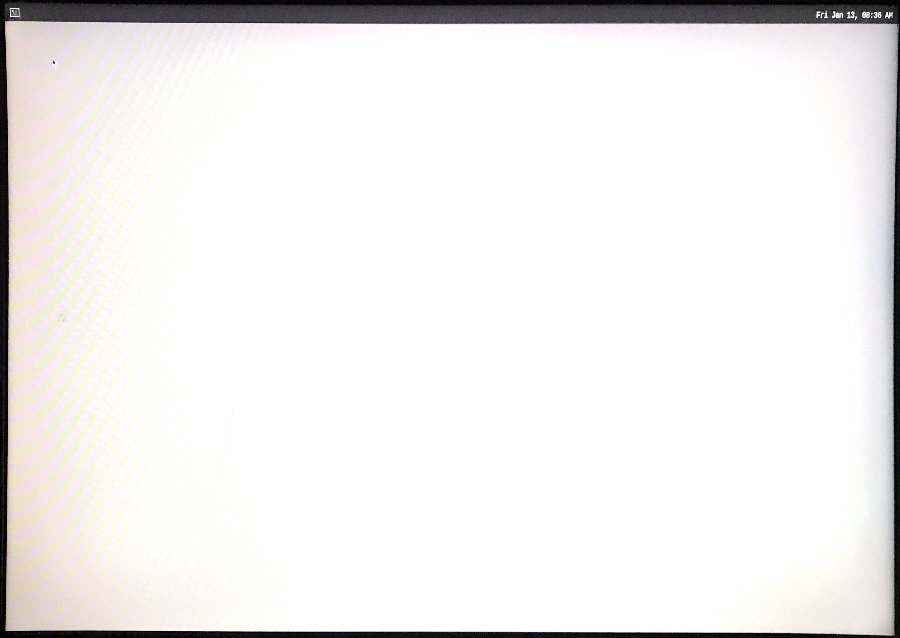
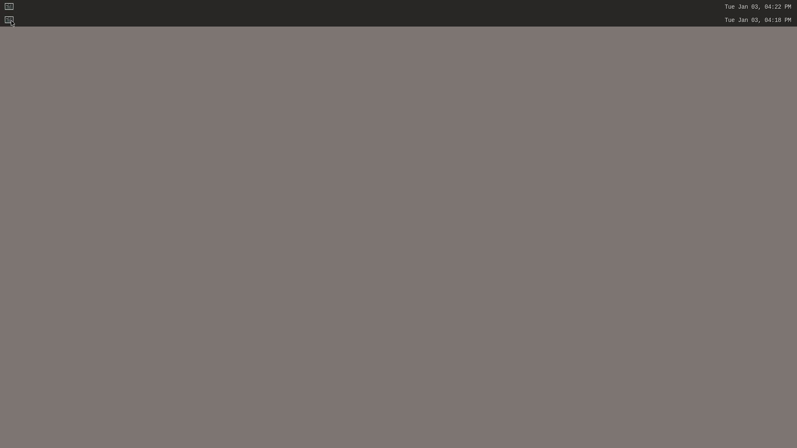

# First steps with XEN

[Back to **Table of Contents**](contents.md)

## List of functionalities

[place holder for start of short list of ## Functionalities]: # (This is used by tool to create a short content list as start point)

[Look for started Dom's](#look-for-started-doms)

[Attach console to DomD](#attach-console-to-domd)

[Attach console to DomU](#attach-console-to-domu)

[Attach console to DomZ](#attach-console-to-domz)

[Destroy and recreate DomU](#destroy-and-recreate-domu)

[place holder for end of short list of ## Functionalities]: # (This is used by tool to create a short content list as end point)

## Description

The XEN system image has been started with attached console to **Domain-0**. Now some first steps show basics of XEN control.

## Prerequisites

System is started like described at [Start the system image of meta-xt-prod-devel-rcar](start-img.md). All following procedures are donw at serial console.

## Functionalities

### Look for started Dom's
**xl** is the major command to interact with XEN. With **xl list** the state of running VM's are put to screen.

```
root@generic-armv8-xt-dom0:~# xl list
Name                                        ID   Mem VCPUs      State   Time(s)
Domain-0                                     0   256     4     r-----     138.4
DomZ                                         1    16     1     -b----     893.1
DomD                                         2  1993     4     -b----      56.2
DomU                                         3  1535     4     -b----       9.3
```

Here:

- **Domain-0**: Domain controling XEN
- **DomZ**: Domain with **Zephyr** test installation
- **DomD**: Standard Linux domain running hardware drivers and 1st instance of **Weston** shell
- **DomU**: Standard Linux domain using provided services by **DomD** and 2nd instance of **Weston** shell

### Attach console to DomD

With **xl console DomD** the console is switched to **DomD**. At first switch after starting the system  all system boot messaged are displayed and a login (**root** without password) is requested. The output at console can look worried.

Example for function:

```
root@generic-armv8-xt-dom0:~# xl console DomD
[    0.000000] Booting Linux on physical CPU 0x0000000000 [0x411fd073]
[    0.000000] Linux version 5.10.0-yocto-standard (oe-user@oe-host) (aarch64-poky-linux-gcc (GCC) 9.5.0, GNU ld (GNU Binutils) 2.34.0.20200910) #1 SMP PREEMPT Wed Jun 16 11:36:54 UTC 2021
[    0.000000] Machine model: XENVM-4.16
[    0.000000] Xen 4.16 support found
[    0.000000] efi: UEFI not found.
[    0.000000] Reserved memory: created CMA memory pool at 0x0000000057000000, size 400 MiB
[    0.000000] OF: reserved mem: initialized node linux,cma@57000000, compatible id shared-dma-pool
[    0.000000] Reserved memory: created CMA memory pool at 0x0000000070000000, size 256 MiB
[    0.000000] OF: reserved mem: initialized node linux,multimedia@70000000, compatible id shared-dma-pool
[    0.000000] Allocated 67108864 bytes for Xen page allocator at 0xbc000000
[    0.000000] Allocated 100663296 bytes for Xen CMA allocator at 0xb6000000

...

[  OK  ] Started Permit User Sessions.
[  OK  ] Started Getty on tty1.
[  OK  ] Started Serial Getty on hvc0.
[  OK  ] Reached target Login Prompts.
[    5.990736] ravb e6800000.ethernet eth0: Link is Up - 100Mbps/Full - flow control off
[    5.990805] IPv6: ADDRCONF(NETDEV_CHANGE): eth0: link becomes ready

Poky (Yocto Project Reference Distro) 3.1.21 h3ulcb-domd hvc0

h3ulcb-domd login: [   19.989123] audit: type=1006 audit(1673606683.298:4): pid=439 uid=0 old-auid=4294967295 auid=0 tty=(none) old-ses=4294967295 ses=1 res=1
[   20.493299] PVR_K:  434: RGX Firmware image 'rgx.fw.4.46.6.62.vz' loaded
[   20.748824] xenbr0: port 1(vif3.0) entered blocking state

...

[   25.146903] IPv6: ADDRCONF(NETDEV_CHANGE): xenbr0: link becomes ready
[   25.177847] audit: type=1325 audit(1673606688.458:7): table=nat family=2 entries=6 op=xt_replace pid=406 comm="systemd-network"

h3ulcb-domd login: root
Last login: Fri Jan 13 10:44:43 UTC 2023
root@h3ulcb-domd:~#

```

The shell prompt is changed, all commands are set to **DomD**.
With **CTRL 5** the console is detached and attached back to **Domain-0**.

### Attach console to DomU

With **xl console DomU** the console is switched to **DomU**. The details are very same to 
[Attach console to DomD](#attach-console-to-domd). With **CTRL 5** the console is detached and attached back to **Domain-0**.

### Attach console to DomZ

At **DomZ** a simple **Zephyr** application with two threads is installed.
With **xl console DomZ** the console is switched to **DomZ**. At first switch after starting the system some system boot messages and all messages of the test application are displayed.

Example for function:

```
[  OK  ] Started Serial Getty on hvc0.
root@generic-armv8-xt-dom0:~# xl console DomZ
[00:00:00.067,000] <inf> xen_events: xen_events_init: events inited

[00:00:00.067,000] <inf> uart_hvc_xen: Xen HVC inited successfully

*** Booting Zephyr OS build zephyr-v3.2.0-3039-gabe50cc92991 ***
thread_a: Hello World from cpu 0 on xenvm!
thread_b: Hello World from cpu 0 on xenvm!
thread_a: Hello World from cpu 0 on xenvm!
thread_b: Hello World from cpu 0 on xenvm!
thread_a: Hello World from cpu 0 on xenvm!
thread_b: Hello World from cpu 0 on xenvm!

...

thread_b: Hello World from cpu 0 on xenvm!
thread_a: Hello World from cpu 0 on xenvm!
thread_b: Hello World from cpu 0 on xenvm!
thread_a: Hello World from cpu 0 onroot@generic-armv8-xt-dom0:~#
root@generic-armv8-xt-dom0:~#
```

With **CTRL 5** the console is detached and attached back to **Domain-0**.

### Destroy and recreate DomU

The system for **DomU** can be easily destroyed (stopped and unloaded) from **Domain-0** with **xl destroy DomU**.

Example for function:

```
root@generic-armv8-xt-dom0:~# xl list
Name                                        ID   Mem VCPUs      State   Time(s)
Domain-0                                     0   256     4     r-----     218.8
DomZ                                         1    16     1     -b----    1394.7
DomD                                         2  1993     4     -b----      81.2
DomU                                         3  1535     4     -b----      10.8
root@generic-armv8-xt-dom0:~# xl destroy DomU
root@generic-armv8-xt-dom0:~# (XEN) [ 8656.157556] Removed GSX d3 (OSID 1)

root@generic-armv8-xt-dom0:~# xl list
Name                                        ID   Mem VCPUs      State   Time(s)
Domain-0                                     0   256     4     r-----     220.6
DomZ                                         1    16     1     -b----    1399.7
DomD                                         2  2047     4     -b----      82.2
root@generic-armv8-xt-dom0:~#

```

**DomU** has been deleted at list running domains. A second hint can be seen at HDMI display:

One of the menu bars of **Weston** has been removed.



With **xl create /etc/xen/domu.cfg** the domain **DomU** is recreated and at HDMI screen the second menu bar reappears. 

Example of function:

```
root@generic-armv8-xt-dom0:~# xl create /etc/xen/domu.cfg
Parsing config from /etc/xen/domu.cfg
libxl: info: libxl_create.c:120:libxl__domain_build_info_setdefault: qemu-xen is unavailable, using qemu-xen-traditional instead: No such file or directory
(XEN) [ 8964.054060] Added GSX d4 (OSID 1)
(XEN) [ 8964.057962] memory_map:add: dom4 gfn=fd000 mfn=fd010 nr=1
(XEN) [ 8964.177444] ipmmu: /soc/mmu@e67b0000: d4: Set IPMMU context 3 (pgd 0x765e34000)
(XEN) [ 8964.185217] ipmmu: /soc/gsx_pv0_domu: Using IPMMU context 3
(XEN) [ 8964.191516] ipmmu: /soc/gsx_pv1_domu: Using IPMMU context 3
(XEN) [ 8964.197814] ipmmu: /soc/gsx_pv2_domu: Using IPMMU context 3
(XEN) [ 8964.204127] ipmmu: /soc/gsx_pv3_domu: Using IPMMU context 3
root@generic-armv8-xt-dom0:~# (XEN) [ 8964.450550] d4v0: vGICD: unhandled word write 0x000000ffffffff to ICACTIVER4
(XEN) [ 8964.458065] d4v0: vGICD: unhandled word write 0x000000ffffffff to ICACTIVER8
(XEN) [ 8964.465582] d4v0: vGICD: unhandled word write 0x000000ffffffff to ICACTIVER12

...

(XEN) [ 8970.170742] grant_table.c:1861:d4v3 Expanding d4 grant table from 21 to 25 frames
(XEN) [ 8970.214831] grant_table.c:1861:d4v3 Expanding d4 grant table from 25 to 29 frames

root@generic-armv8-xt-dom0:~# xl list
Name                                        ID   Mem VCPUs      State   Time(s)
Domain-0                                     0   256     4     r-----     229.1
DomZ                                         1    16     1     r-----    1449.8
DomD                                         2  1994     4     -b----      86.9
DomU                                         4  1535     4     -b----       6.5
root@generic-armv8-xt-dom0:~#
```

Contents at HDMI screen:




## Results

Now some basic commands to interact with XEN system is known, so other functionalities can be accessed.

## Additional hints


