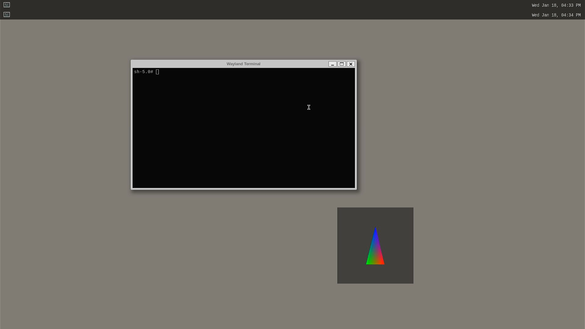
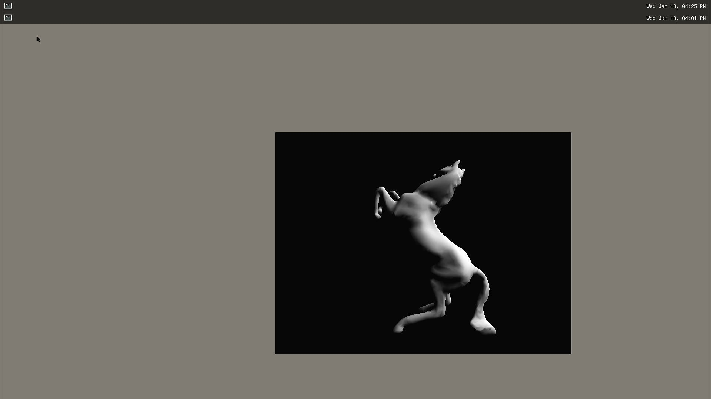

# Some graphic tests

[Back to contents](contents.md)

## List of functionalities

[place holder for start of short list of ## Functionalities]: # (This is used by tool to create a short content list as start point)

[Start weston-simple-egl at DomD and DomU](#start-weston-simple-egl-at-domd-and-domu)

[Start glmark2-es-wayland at DomD and DomU](#start-glmark2-es-wayland-at-domd-and-domu)

[place holder for end of short list of ## Functionalities]: # (This is used by tool to create a short content list as end point)


## Description

If the system has been started correctly, a **Weston** shell with two menu bars is visible at HDMI screen. Graphic tests can be started both from serial console and terminal of **DomD**. Graphics of **DomU** can only be started from serial console.

## Prerequisites

- System setup like described at [Start the system image of meta-xt-prod-devel-rcar](start-img.md)
- HDMI screen connected to Renesas target
- For **glmark2-es-wayland** functionality the image has to be extended. For example add **glmark2** to **<topdir\>//yocto/meta-renesas/meta-rcar-gen3/recipes-graphics/packagegroups/packagegroup-graphic-renesas.bb** at image building (have look at [Build the system image](#build-the-system-image)

Example for diff:

```
diff --git a/meta-rcar-gen3/recipes-graphics/packagegroups/packagegroup-graphic-renesas.bb b/meta-rcar-gen3/recipes-graphics/packagegroups/packagegroup-graphic-renesas.bb
index e0ec1a4..27a1b11 100644
--- a/meta-rcar-gen3/recipes-graphics/packagegroups/packagegroup-graphic-renesas.bb
+++ b/meta-rcar-gen3/recipes-graphics/packagegroups/packagegroup-graphic-renesas.bb
@@ -18,6 +18,7 @@ RDEPENDS_packagegroup-wayland-community = " \
     wayland \
     weston \
     weston-examples \
+    glmark2 \
     alsa-utils \
     alsa-tools \
     libdrm-tests \

```

## Functionalities

### Start weston-simple-egl at DomD and DomU

The simple EGL test of weston displays a rotating triangle.
It can be simply started by "**weston-simple-egl**" at **DomD** ([Attach console to DomD](#attach-console-to-domd)) or **DomU** console ([Attach console to DomU](#attach-console-to-domu)).

Example for function (at **DomD**):

```
root@h3ulcb-domd:~# weston-simple-egl
has EGL_EXT_buffer_age and EGL_EXT_swap_buffers_with_damage
301 frames in 5 seconds: 60.200001 fps
301 frames in 5 seconds: 60.200001 fps
301 frames in 5 seconds: 60.200001 fps
...
```




### Start glmark2-es-wayland at DomD and DomU

The **glmark2-es-wayland** test displays some 3D graphic tests and measures the performance.
It can be simply started by "**glmark2-es-wayland**" at **DomD** ([Attach console to DomD](#attach-console-to-domd)) or **DomU** console ([Attach console to DomU](#attach-console-to-domu)).

Example for function (at **DomD**):

```
root@h3ulcb-domd:~# glmark2-es2-wayland
=======================================================
    glmark2 2017.07
=======================================================
    OpenGL Information
    GL_VENDOR:     Imagination Technologies
    GL_RENDERER:   PowerVR Rogue GX6650
    GL_VERSION:    OpenGL ES 3.2 build 1.11@5516664
=======================================================
[build] use-vbo=false: FPS: 89 FrameTime: 11.236 ms
[build] use-vbo=true:
...
```



## Results

## Additional hints

