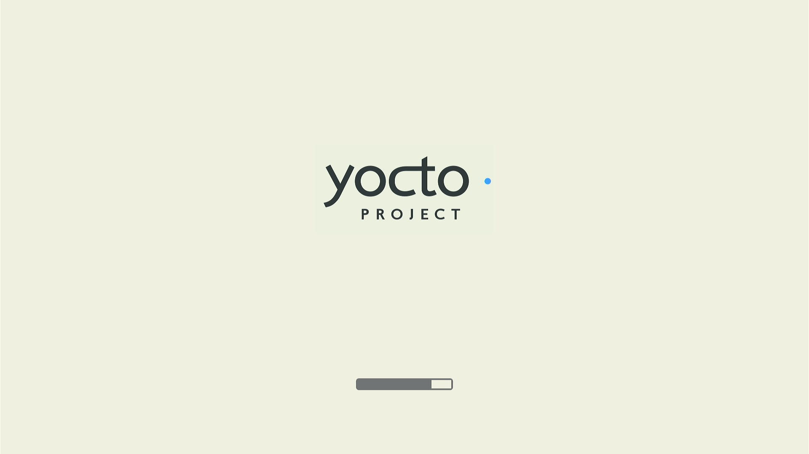

# Start the system image of meta-xt-prod-devel-rcar

[Back to contents](contents.md)

## List of functionalities

[place holder for start of short list of ## Functionalities]: # (This is used by tool to create a short content list as start point)

[Configuration of U-Boot](#configuration-of-u-boot)

[Start the image](#start-the-image)

[Login to Dom0](#login-to-dom0)

[place holder for end of short list of ## Functionalities]: # (This is used by tool to create a short content list as end point)

## Description

The bootloader **U-Boot** has to start the image. For this a startup procedure is needed, which
- Configures U-Boot to start the system image.
- Starts the image with a script stored at environment of U-Boot
- Login to Dom0 system as interface to XEN

## Prerequisites

- System image built and flashed like described at [Build the system image(s) of meta-xt-prod-devel-rcar](build-img.md)
- Supported Renesas target with working internet connection (router with DHCP)
- Serial console like Putty, Theraterm, Minicom, etc.
- HDMI screen connected to target
- Input devices like 
    - keyboard+mouse
    - keyboard+touch screen 

## Functionalities
The following steps are described for Renesas RCAR Starter Kit Premium 3.0 (H3SK).

### Configuration of U-Boot

Please set the environment of U-boot to defaults with

    env default -a

[Setup U-boot](https://github.com/xen-troops/meta-xt-prod-devel-rcar/blob/master/doc/u-boot-env.md#common-settings-recommended-for-any-boot-device) describes the basic steps. At built U-boot most steps are preconfigured. 

### Start the image

If image is flashed to SD card, it is started from U-Boot prompt with:

    run bootcmd_sd0

Serial console:

Boot screen at HDMI monitor:

Initial screen At HDMI monitor:

### Login to Dom0

The login without password is **root**. Please regard, the prompt is overwritten by boot message

## Results

Now the system can be controlled both by serial console and HDMI UI (keyboard +  pointing device).

## Additional hints

The initial screen at HDMI shows a doubled menu bar of **Weston**. This is caused by two instances of **Weston** for **DomD** (Domain with drivers) and **DomU** (unprivileged domain).
