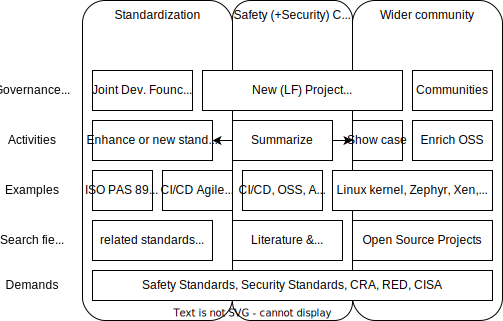

# Objective & Motivation

The established practice for the creation of electronic software-based control systems in regulated industries is based on methodological approaches that were developed for proprietary software development and do not take open source code driven development into account. However, the success of open source software in critical business and societal applications demonstrates its ability to deliver results comparable to proprietary development companies. 

Open source communities have proven their effectiveness and methodology, leading to widespread acceptance in areas with strict security regulations and certifications. This level of quality makes open source software a viable option for other regulated domains, including functional safety.

As a consequence, to enable the wider adoption of open source software in other (regulated) industries, it is crucial to ensure proper documentation of the processes executed by open source communities as e.g. safety standards enforce. This documentation will provide transparency and facilitate understanding of the methodologies employed, to be referred to as a quality management system for code driven development.

# Introduction

This document targets to describe equivalence of established open source development practices for the purpose of quality assurance comparable to requirements driven development. Industry standards for software quality do not prescribe any individual technique or method in detail. However, a lifecycle process is described that essentially corresponds to the V-model together with techniques that are rarely found in open source projects.

The suitability of open source practices to deliver necessary work products equivalent to those from traditional design, implementation, integration and maintenance requires further analysis. This report will identify the capabilities and possible gaps to establish equivalence between open source practices and established industry software lifecycle standards.

## Relation to functional safety

Quality, Cyber Security and Functional Safety (FuSa) integrity standards aim for a certain level of reliability for the development of electronic devices with a protective function for hazardous machines and systems that reduces the risk to people and society when operating these machines and systems to an acceptable level. All these standards, although aiming for different verticals as well as different risk scenarios, address the risk reduction by raising the resilience and stability of a software project.

To address this, FuSa integrity standards such as IEC 61508 or ISO 26262 describe a process with methods and tools for the development of electronic systems with safety relevant functions, with which the unavoidable risk of errors is reduced to an acceptable level. For the software part of these systems, these are essentially qualitative methods. Simply put, the core statement of the FuSa standards is that software that has been carefully developed according to the specifications cannot be improved with reasonable effort and is therefore suitable for use as a safety application.

# Literature and references for open source development process

IEEE computer society definition about Software quality: https://www.computer.org/resources/what-is-software-quality

Producing Open Source Software - How to Run a Successful Free Software Project: https://producingoss.com/

## Linux Kernel

## Examples from academia

Various publications from research have been made about the open source development process. A list of examples is placed below. A good overview on potential publications was done by the *Open Source Software Development Process: A Systematic Review* publication in 2020 [1]. The document also serves as an input for this work. However, the referenced work inside the paper only has limited evidence about OSS project making heavy use of CI/CD practices. Also, the workflows observed on GitHub and GitLab (to name to prominent example hosts for open soruce projects) are not reflected in the flow charts within the paper.

  
[1] Open Source Software Development Process: A Systematic Review 

  
  Link: [arXiv:2008.05015](https://arxiv.org/abs/2008.05015)
  
  **Abstract**
  Open Source Software (OSS) has been recognized by the software development community as an effective way to deliver software. Unlike traditional software development, OSS development is driven by collaboration among developers spread geographically and motivated by common goals and interests. Besides this fact, it is recognized by OSS community the need of understand OSS development process and its activities. Our goal is to investigate the state-of-art about OSS process through conducting a systematic literature review providing an overview of how the OSS community has been investigating OSS process over past years identifying and summarizing OSS process activities and their characteristics as well as translating OSS process in a macro process through BPMN notation. As a result, we systematically analysed 33 studies presenting an overview of the state-of-art of researches regarding OSS process, a generalized OSS development macro process represented by BPMN notation with a detailed description of each OSS process activity and roles in OSS environment. We conclude that OSS process can be in practice further investigated by researchers. In addition, the presented OSS process can be used as a guide for OSS projects and being adapted according to each OSS project reality. It provides insights to managers and developers who want to improve their development process even in OSS and traditional environments. Finally, recommendations for OSS community regarding OSS process activities are provided. 

  
[2] Evaluation of open source operating
systems for safety-critical applications 

  
  Link: [Chalmers Master Thesis](https://odr.chalmers.se/server/api/core/bitstreams/3c83d9c5-e4ea-4ecc-b43a-7035a756ce1f/content)
  
  **Abstract**
  Today many embedded applications will have to handle multitasking with real-time time constraints and the solution for handling multitasking is to use a real-time operating system for scheduling and managing the real-time tasks. There are many different open source real-time operating systems available and the use of open source software for safety-critical applications is considered highly interesting by industries such as medical, aerospace and automotive as it enables a shorter time to market and lower development costs. If one would like to use open source software in a safety-critical context one would have to provide evidence that the software being used fulfills the requirement put forth by the industry specific standard for functional safety, such as the ISO 26262 standard for the automotive industry. However, the standards for functional safety do not provide a clear method for how one would go about certifying open source software. Therefore, in this thesis we present identified important characteristics that can be used for comparing the suitability of open source based real-time operating systems for use in safety-critical applications together with a proposed outline for a methodology that can be used for certifying an open source real-time operating system. A case study has been done where we compared two open source operating systems for small microcontrollers with the previously mentioned characteristics in order to see which of the two is most suitable for use in safety-critical applications. The most suitable candidate is then assessed in order to see to what degree it can adhere with the requirements put forth in the widely used functional safety standards IEC 61508 and ISO 26262.

# Code first/driven development process

## Ideation phase

## Requirements and change management

# Typical Work products from traditional standards

Examples for traditional standards can be seen as [ASPICE](https://vda-qmc.de/en/automotive-spice/), [ISO26262](https://www.iso.org/obp/ui/en/#iso:std:iso:26262:-1:ed-2:v1:en) or [CMMI](). These traditional standards come from a *requirements first* mentality. Also, they are executed along the so called "*v-model*". Two overviews 

**Overview of the ISO26262 series of standards**

**Overview of the Automotive SPICE® process dimensions**

Examples for artifacts and work products out of these standards are:

- Requirements
- Specifications
- Design
- Implementation
- Test Cases
- Review Records
- Reports
- Traceability matrixes

Many standards are hidden behind a paywall, while Automotive SPICE® provides a [public accessible version](https://vda-qmc.de/wp-content/uploads/2023/12/Automotive-SPICE-PAM-v40.pdf). Showing the equivalence to work products as requested by ASPICE, but following a code driven development process, rather then a requirements driven development process, forms a base for further argumentation  

## Open Source projects with standard compliance (argumentation)

### Open source projects under foundations

- Zephyr project [[Contributing](https://docs.zephyrproject.org/latest/contribute/index.html)]
- Xen project [[Documentation](https://xenproject.org/help/contribution-guidelines/)]
- 

### Examples from "Company owned" open source projects

- L4Re (originator Kernkonzept GmbH) [product page](https://www.kernkonzept.com/l4re-operating-system-framework/)[project page](https://l4re.org/)
- ThreadX (originator Microsoft, now under Eclipse) [project page](https://threadx.io/)
- 

### Standards/Initiaives supporting code first and CI/CD driven development

- ISO/PAS 8926 [add link]

# Best practices and examples from open source projects

Remark: This work has its origin in the [Systems WG development process wiki](https://github.com/elisa-tech/wg-systems/wiki/Systems-WG-development-process)