# Introduction

# Literature and references for open source development process

IEEE computer society definition about Software quality: https://www.computer.org/resources/what-is-software-quality

## Linux Kernel

## Examples from academia

Various publications from research have been made about the open source development process. A list of examples is placed below. A good overview on potential publications was done by the *Open Source Software Development Process: A Systematic Review* publication in 2020 [1]. The document also serves as an input for this work. However, the referenced work inside the paper only has limited evidence about OSS project making heavy use of CI/CD practices. Also, the workflows observed on GitHub and GitLab (to name to prominent example hosts for open soruce projects) are not reflected in the flow charts within the paper.

  
[1] Open Source Software Development Process: A Systematic Review 

  
  Link: [arXiv:2008.05015](https://arxiv.org/abs/2008.05015)
  
  **Abstract**
  Open Source Software (OSS) has been recognized by the software development community as an effective way to deliver software. Unlike traditional software development, OSS development is driven by collaboration among developers spread geographically and motivated by common goals and interests. Besides this fact, it is recognized by OSS community the need of understand OSS development process and its activities. Our goal is to investigate the state-of-art about OSS process through conducting a systematic literature review providing an overview of how the OSS community has been investigating OSS process over past years identifying and summarizing OSS process activities and their characteristics as well as translating OSS process in a macro process through BPMN notation. As a result, we systematically analysed 33 studies presenting an overview of the state-of-art of researches regarding OSS process, a generalized OSS development macro process represented by BPMN notation with a detailed description of each OSS process activity and roles in OSS environment. We conclude that OSS process can be in practice further investigated by researchers. In addition, the presented OSS process can be used as a guide for OSS projects and being adapted according to each OSS project reality. It provides insights to managers and developers who want to improve their development process even in OSS and traditional environments. Finally, recommendations for OSS community regarding OSS process activities are provided. 

# Code first/driven development process

## Ideation phase

## Requirements and change management

# Typical Work products from traditional standards

Examples for traditional standards can be seen as [ASPICE](https://vda-qmc.de/en/automotive-spice/), [ISO26262](https://www.iso.org/obp/ui/en/#iso:std:iso:26262:-1:ed-2:v1:en) or [CMMI](). These traditional standards come from a *requirements first* mentality. Also, they are executed along the so called "*v-model*". Two overviews 

**Overview of the ISO26262 series of standards**

**Overview of the Automotive SPICE® process dimensions**

Examples for artifacts and work products out of these standards are:

- Requirements
- Specifications
- Design
- Implementation
- Test Cases
- Review Records
- Reports
- Traceability matrixes

Many standards are hidden behind a paywall, while Automotive SPICE® provides a [public accessible version](https://vda-qmc.de/wp-content/uploads/2023/12/Automotive-SPICE-PAM-v40.pdf). Showing the equivalence to work products as requested by ASPICE, but following a code driven development process, rather then a requirements driven development process, forms a base for further argumentation  

## Open Source projects with standard compliance (argumentation)

### Open source projects under foundations

- Zephyr project [[Contributing](https://docs.zephyrproject.org/latest/contribute/index.html)]
- Xen project [[Documentation](https://xenproject.org/help/contribution-guidelines/)]
- 

### Examples from "Company owned" open source projects

- L4Re (originator Kernkonzept GmbH) [product page](https://www.kernkonzept.com/l4re-operating-system-framework/)[project page](https://l4re.org/)
- ThreadX (originator Microsoft, now under Eclipse) [project page](https://threadx.io/)
- 

### Standards/Initiaives supporting code first and CI/CD driven development

- ISO/PAS 8926 [add link]

# Best practices and examples from open source projects

Remark: This work has its origin in the [Systems WG development process wiki](https://github.com/elisa-tech/wg-systems/wiki/Systems-WG-development-process)