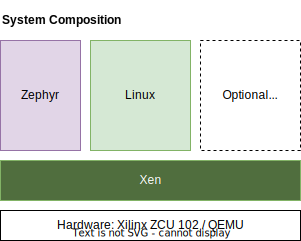

# Table of Contents

## Introduction

The example system setup should illustrate the interaction of different system components
represented by Zephyr as RTOS running on the µProcessor on top of Xen as Hypervisor, and with a Linux flavour (yocto, Debian) as an additional domain/VM next to Zepyhr. 

In the example system the hardware is represented by a Xilinx ZCU102. It can also be a 
Qemu image. The below image illustrates the essential blocks of the example system.

An overview of the central elements involved in the build, as software elements, 
hardware and peripherals (local tools) can be depicted from the system component overview
below:

It is intended to enhance the demo to further configurations and to replace central elements 
by adding alternative implementation for the hardware and system elements.

Demo cases should be enhanced to represent real world use cases and help as an example
to create own use case on top.

## Setup

[Overview to all parts of XEN demo](overview2parts.md)

[Setup of XEN demo image for USB stick or SD card (restricted function)](cr-demo-image.md)

[Setup of XEN boot image for SD card](cr-boot-image.md)

[Build parts of Domain-0 with XEN](cr-xen-parts.md)

[Create XEN demo and boot images with a simple script](cr-image-script.md)

[Setup Qemu system with demo and boot image](setup-qemu.md)

## Get parts for VM's

[Get parts of Apertis system](get-apertis-parts.md)

[Get parts of Zephyr system](get-zephyr-parts.md)

[Get parts of Petalinux system](get-petalinux-parts.md)

## Demo cases

[Demo case with simple Linux VM (Petalinux)](test-simple.md)

[Demo case with Zephyr VM](test-zephyr.md)

[Demo case with Linux VM (Apertis)](test-apertis.md)

[Demo case with paravirtualized partition](test-pv-disk.md)

[Demo case with paravirtualized network](test-pv-net.md)

[Demo case with passed through SD controller](test-pt-disk.md)

[Demo case with passed through NIC controller](test-pt-net.md)

