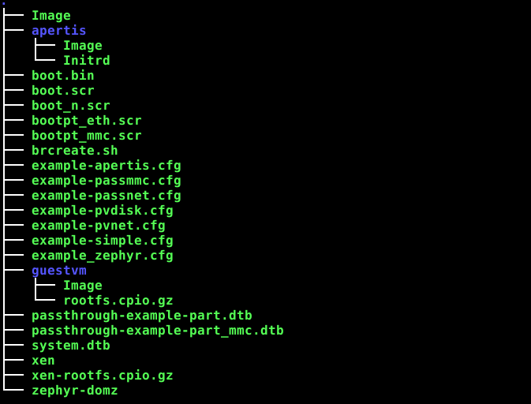

# Setup of XEN demo image for USB stick or SD card (restricted function)

[Back to **Table of Contents**](Readme.md)

This description explains the setup of a demo image at USB stick, connected to ZCU102. The image can also be used at SD card, but then the **pass through** demo cases are not possible.

## General
The image has a MSDOS partitioning scheme with three formatted partitions. 

- P1: FAT, 1GB
- P2: EXT4, 2GB
- P3: EXT4, 3GB

There are multiple ways to create such a SD card, but
this description bases on following tools:

- Debos:    Image creation tool, available at Debian. Description at <https://packages.debian.org/bullseye/debos>
- Bmaptool: Image writing tool. Description at <https://packages.debian.org/bullseye/bmap-tools>

## Create an image file
The related .yaml recipe is provided at [image_boot.yaml](configs/image_boot.yaml).
The image file can be created by

    sudo debos image_demo.yaml

which creates a file **xen-demo.img**.

## Description of content of partition 1
This partition is formatted with FAT filesystem and keeps both the configurations and most of the artefacts of the demo system.

As file list:

* Image
* boot.bin
* boot.scr
* example-pvnet.cfg
* system.dtb
* xen
* xen-rootfs.cpio.gz
* apertis/Image
* apertis/Initrd
* example-apertis.cfg
* example-simple.cfg
* guestvm/rootfs.cpio.gz
* guestvm/Image
* brcreate.sh
* example-passmmc.cfg
* example-passnet.cfg
* boot_n.scr
* bootpt_eth.scr
* bootpt_mmc.scr
* passthrough-example-part.dtb
* passthrough-example-part_mmc.dtb
* example_zephyr.cfg
* zephyr-domz
* example-pvdisk.cfg

Please have a look to [Overview to all parts of XEN demo](overview2parts.md) to get more information.

## Description of content of partition 2
This partition is formatted with ext4 filesystem and keeps a persistant mirror of **/etc** of Domain-0. This simplifies the handling of Domain-0 at multiple reboots. 

The partition can be set up with following steps:

### Mount the image file
The image file can be mounted to a given mount directory with

    mkdir rootdemop2/
    LOOPDEV=$(sudo losetup -f)
    sudo losetup -P $LOOPDEV xen-demo.img
    sudo mount ${LOOPDEV}p2 rootdemop2/

### Extract the /etc from xen-rootfs.cpio.gz (InitRamFs of Domain-0)

    mkdir etc/
    zcat xen-rootfs.cpio.gz  | sudo cpio -i "etc/*"
    sudo tar czf etc.tar.gz etc/

### Unmount the image file

The image file can be umounted with 

    sudo umount rootdemop2
    sudo losetup -d $LOOPDEV

## Description of content of partition 3 

This is simply the root file system **rootfs.tar.gz** of Petalinux got at [Get parts of Petalinux system](get-petalinux-parts.md) and can be established with

### Mount the image file
The image file can be mounted to a given mount directory with

    mkdir rootdemop3/
    LOOPDEV=$(sudo losetup -f)
    sudo losetup -P $LOOPDEV xen-demo.img
    sudo mount ${LOOPDEV}p2 rootdemop3/

### Extract the root file system of Petalinux guest (only a sample)

    sudo tar xf rootfs.tar.gz  -C rootdemop3/

### Unmount the image file

The image file can be umounted with 

    sudo umount rootdemop3
    sudo losetup -d $LOOPDEV

