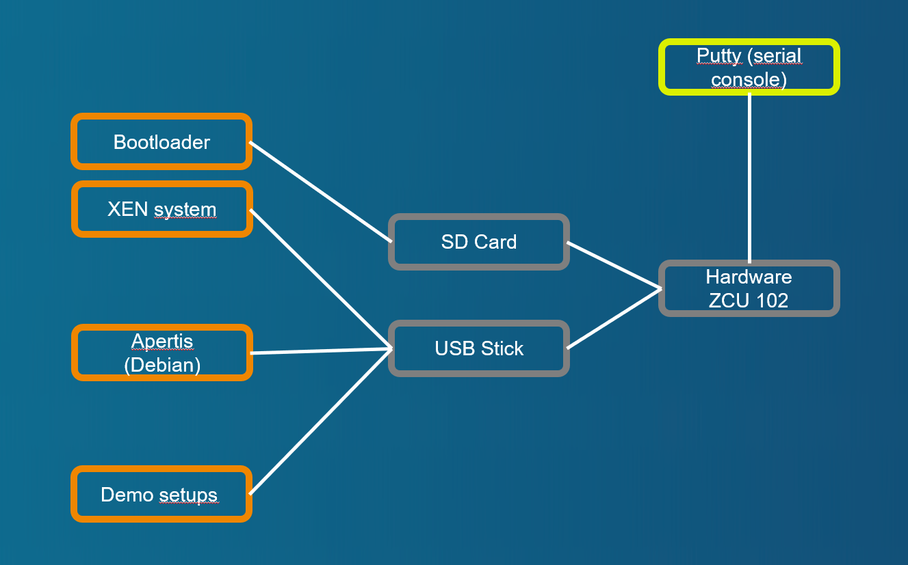

# Demo case with Linux VM (Apertis)

[Back to **Table of Contents**](Readme.md)

## Setup and parts



Connections of ZCU102 board:

- USB stick with demo image, desription at [Setup of XEN demo image for USB stick or SD card (restricted function)](cr-demo-image.md)
- SD card with boot image, dicription at [Setup of XEN boot image for SD card](cr-boot-image.md)

## Demo sequence

### Starting with bootloader

U-Boot starts **** and without configuration nested script ****.

### Booting with XEN and Domain-0

Credentials at brandnew system are **login=petalinux**, password can be according needs of the tester.

### Starting "Apertis" demo with Apertis ramdisk image
Start **Apertis** with configuration at ****. Following or similar output should be displayed:

```
zcu102-zynqmp:~$ cd /media/card
zcu102-zynqmp:/media/card$ sudo xl create example-apertis.cfg
Password:
Parsing config from example-apertis.cfg
libxl: info: libxl_create.c:122:libxl__domain_build_info_setdefault: qemu-xen is unavailable, using qemu-xen-traditional instead: No such file or directory
(XEN) xen-source/xen/common/sched/null.c:355: 1 <-- d2v0
zcu102-zynqmp:/media/card$ (XEN) d2v0 Unhandled SMC/HVC: 0x84000050
(XEN) d2v0 Unhandled SMC/HVC: 0x8600ff01
(XEN) d2v0: vGICD: unhandled word write 0x000000ffffffff to ICACTIVER4
(XEN) d2v0: vGICD: unhandled word write 0x000000ffffffff to ICACTIVER8
(XEN) d2v0: vGICD: unhandled word write 0x000000ffffffff to ICACTIVER12
(XEN) d2v0: vGICD: unhandled word write 0x000000ffffffff to ICACTIVER16
(XEN) d2v0: vGICD: unhandled word write 0x000000ffffffff to ICACTIVER20
(XEN) d2v0: vGICD: unhandled word write 0x000000ffffffff to ICACTIVER0
(XEN) xen-source/xen/common/sched/null.c:355: 3 <-- d2v1
(XEN) d2v1: vGICD: unhandled word write 0x000000ffffffff to ICACTIVER0

zcu102-zynqmp:/media/card$

```

### Switch console to Apertis
Check for started domains and switch to console of **Apertis**. Following or similar output should be displayed:
```
zcu102-zynqmp:/media/card$ sudo xl list
Name                                        ID   Mem VCPUs      State   Time(s)
Domain-0                                     0  1024     1     r-----     167.4
Apertis                                      1  1023     2     r-----     196.6
zcu102-zynqmp:/media/card$ sudo xl console Apertis
...
[  OK  ] Started Serial Getty on hvc0.
[  OK  ] Reached target Login Prompts.
[  OK  ] Started OpenBSD Secure Shell server.
[  OK  ] Reached target Multi-User System.
[  OK  ] Reached target Graphical Interface.
         Starting Update UTMP about System Runlevel Changes...
[  OK  ] Finished Update UTMP about System Runlevel Changes.

Apertis v2022 apertis-nano hvc0
apertis-nano login:
```

Login with **login=user**, **password=user**.

### No Network interfaces
Look for network interfaces with **ifconfig**. Following or similar output should be displayed:

```
$ ifconfig
lo        Link encap:Local Loopback
          inet addr:127.0.0.1  Mask:255.0.0.0
          inet6 addr: ::1/128 Scope:Host
          UP LOOPBACK RUNNING  MTU:65536  Metric:1
          RX packets:0 errors:0 dropped:0 overruns:0 frame:0
          TX packets:0 errors:0 dropped:0 overruns:0 carrier:0
          collisions:0 txqueuelen:1000
          RX bytes:0 (0.0 B)  TX bytes:0 (0.0 B)

$
```

No interfaces but **lo** exist.

### No block devices but ramdisks
Look for network interfaces with **cat /proc/partitions**. Following or similar output should be displayed:

```
$ cat /proc/partitions
$
```

No block devices exist.

### Getting back console to Domain-0 (XEN)

Use **CTRL+5** to get back control to Domain-0.

### Destroy DomU Apertis

Use **xl destroy Apertis** to destroy Apertis VM. Following or similar output should be displayed:

```
zcu102-zynqmp:/media/card$ sudo xl destroy Apertis
Password:
(XEN) gnttab_mark_dirty not implemented yet
zcu102-zynqmp:/media/card$ (XEN) xen-source/xen/common/sched/null.c:385: 3 <-- NULL (d1v1)
(XEN) xen-source/xen/common/sched/null.c:385: 1 <-- NULL (d1v0)
zcu102-zynqmp:/media/card$
```

### Guest0 has been removed from XEN domain list

Use **xl list** to look for state of XEN. Following or similar output should be displayed:
```
zcu102-zynqmp:/media/card$ sudo xl list
Name                                        ID   Mem VCPUs      State   Time(s)
Domain-0                                     0  1024     1     r-----     737.7
zcu102-zynqmp:/media/card$
```

Domain **Apertis** has been destroyed.

