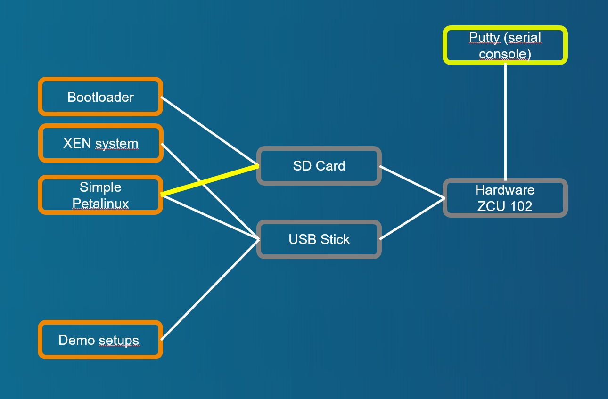

# Demo case with passed through SD controller

[Back to **Table of Contents**](Readme.md)

## Setup and parts



Connections of ZCU102 board:

- USB stick with demo image, desription at [Setup of XEN demo image for USB stick or SD card (restricted function)](cr-demo-image.md)
- SD card with boot image, dicription at [Setup of XEN boot image for SD card](cr-boot-image.md)
- SD card controller is passed to **guest0** vm.

## Demo sequence

### Interrupt the automatic boot process at bootloader
Reset the board and press a key while displaying **Hit any key to stop autoboot:**.

```
U-Boot 2023.01 (Mar 29 2023 - 13:08:40 +0000)

CPU:   ZynqMP
Silicon: v3
Chip:  zu9eg
Model: ZynqMP ZCU102 Rev1.0
Board: Xilinx ZynqMP
DRAM:  2 GiB (effective 4 GiB)
PMUFW:  v1.1
PMUFW:  No permission to change config object
Xilinx I2C Legacy format at nvmem0:
 Board name:    zcu102
 Board rev:     1.0
 Board SN:      881471742302-79140
 Ethernet mac:  00:0a:35:07:d4:af
EL Level:       EL2
Secure Boot:    not authenticated, not encrypted
Core:  76 devices, 31 uclasses, devicetree: board
NAND:  0 MiB
MMC:   mmc@ff170000: 0
Loading Environment from FAT... *** Error - No Valid Environment Area found
*** Warning - bad env area, using default environment

In:    serial
Out:   serial
Err:   serial
Bootmode: LVL_SHFT_SD_MODE1
Reset reason:   EXTERNAL
Net:
ZYNQ GEM: ff0e0000, mdio bus ff0e0000, phyaddr 12, interface rgmii-id
eth0: ethernet@ff0e0000
scanning bus for devices...
SATA link 0 timeout.
SATA link 1 timeout.
AHCI 0001.0301 32 slots 2 ports 6 Gbps 0x3 impl SATA mode
flags: 64bit ncq pm clo only pmp fbss pio slum part ccc apst
starting USB...
Bus usb@fe200000: Register 2000440 NbrPorts 2
Starting the controller
USB XHCI 1.00
scanning bus usb@fe200000 for devices... 6 USB Device(s) found
       scanning usb for storage devices... 1 Storage Device(s) found
Hit any key to stop autoboot:  0
ZynqMP>

```

### Configure passthrough of SD card device as "passtrough"
Set variable **bmode** to **pt_mmc** before starting **** to select boot script ****.

```
ZynqMP> setenv bmode pt_mmc
ZynqMP> boot

```

### Booting with XEN and Domain-0

Credentials at brandnew system are **login=petalinux**, password can be according needs of the tester.

### /dev/mmcblk0 (SD card) is not assigned to Domain-0
With **cat /proc/partitions** check the state of assigned devices. **/dev/mmcblk0p1** has not been assigned do **Domain-0**. 

```
zcu102-zynqmp:~$ cat /proc/partitions
major minor  #blocks  name

   1        0      65536 ram0
   1        1      65536 ram1
   1        2      65536 ram2
   1        3      65536 ram3
   1        4      65536 ram4
   1        5      65536 ram5
   1        6      65536 ram6
   1        7      65536 ram7
   1        8      65536 ram8
   1        9      65536 ram9
   1       10      65536 ram10
   1       11      65536 ram11
   1       12      65536 ram12
   1       13      65536 ram13
   1       14      65536 ram14
   1       15      65536 ram15
  31        0       1024 mtdblock0
  31        1       5120 mtdblock1
  31        2        128 mtdblock2
  31        3       6016 mtdblock3
   8        0   30062592 sda
   8        1    1048576 sda1
   8        2    1880064 sda2
   8        3    2929664 sda3
zcu102-zynqmp:~$

```

### Starting Petalinux ramdisk image as Guest0 with passthrough configuration of SD card device

Start **Petalinux** with configuration at ****. Following or similar output should be displayed:

```
zcu102-zynqmp:/media/card$ sudo xl create example-passmmc.cfg
Password:
Parsing config from example-passmmc.cfg
libxl: info: libxl_create.c:122:libxl__domain_build_info_setdefault: qemu-xen is unavailable, using qemu-xen-traditional instead: No such file or directory
(XEN) memory_map:add: dom1 gfn=ff170 mfn=ff170 nr=1 cache=0
(XEN) memory_map:add: dom1 gfn=ff110 mfn=ff110 nr=1 cache=0
(XEN) memory_map:add: dom1 gfn=ff120 mfn=ff120 nr=1 cache=0
(XEN) memory_map:add: dom1 gfn=ff130 mfn=ff130 nr=1 cache=0
(XEN) memory_map:add: dom1 gfn=ff140 mfn=ff140 nr=1 cache=0
(XEN) smmu: /axi/smmu@fd800000: d1: p2maddr 0x000000087ff22000
(XEN) xen-source/xen/common/sched/null.c:355: 1 <-- d1v0
zcu102-zynqmp:/media/card$ (XEN) d1v0 Unhandled SMC/HVC: 0x84000050
(XEN) d1v0 Unhandled SMC/HVC: 0x8600ff01
(XEN) d1v0: vGICD: unhandled word write 0x000000ffffffff to ICACTIVER4
(XEN) d1v0: vGICD: unhandled word write 0x000000ffffffff to ICACTIVER8
(XEN) d1v0: vGICD: unhandled word write 0x000000ffffffff to ICACTIVER12
(XEN) d1v0: vGICD: unhandled word write 0x000000ffffffff to ICACTIVER16
(XEN) d1v0: vGICD: unhandled word write 0x000000ffffffff to ICACTIVER20
(XEN) d1v0: vGICD: unhandled word write 0x000000ffffffff to ICACTIVER0
(XEN) xen-source/xen/common/sched/null.c:355: 3 <-- d1v1
(XEN) d1v1: vGICD: unhandled word write 0x000000ffffffff to ICACTIVER0
...
zcu102-zynqmp:/media/card$
```

### Switch console to Guest0
Check for started domains and switch to console of **guest0**. Login with **login=petalinux**. Following or similar output should be displayed:
```
zcu102-zynqmp:/media/card$ sudo xl console guest0
...
[  OK  ] Started User Login Management.
[  OK  ] Reached target Multi-User System.
         Starting Record Runlevel Change in UTMP...
[  OK  ] Finished Record Runlevel Change in UTMP.

PetaLinux 2022.2_release_S10071807 xilinx-zcu102-20222 hvc0

xilinx-zcu102-20222 login:
```

### /dev/mmcblk0 is the passed through SD card device and keeps only the bootloader

Now **/dev/mmcblk0** is part of partitions list.

```
xilinx-zcu102-20222:~$ cat /proc/partitions
major minor  #blocks  name

   1        0      65536 ram0
   1        1      65536 ram1
   1        2      65536 ram2
   1        3      65536 ram3
   1        4      65536 ram4
   1        5      65536 ram5
   1        6      65536 ram6
   1        7      65536 ram7
   1        8      65536 ram8
   1        9      65536 ram9
   1       10      65536 ram10
   1       11      65536 ram11
   1       12      65536 ram12
   1       13      65536 ram13
   1       14      65536 ram14
   1       15      65536 ram15
 179        0    7977472 mmcblk0
 179        1    7340031 mmcblk0p1
xilinx-zcu102-20222:~$

```
### Try to mount P1 of SD card device and have a look

**/dev/mmcblk0** is accessible from **guest0** and can be mounted to show the content (**boot.bin**)

```
xilinx-zcu102-20222:~$ sudo mount /dev/mmcblk0p1 /mnt/
Password:
xilinx-zcu102-20222:~$ sudo ls /mnt/
boot.bin
xilinx-zcu102-20222:~$

```

### Guest0 is not destroyed, but initiates a normal shutdown.

**guest0** does the shutdown with **sudo shutdown -P now**. The console returns to **Domain-0**.

```
xilinx-zcu102-20222:~$ sudo shutdown -P now

We trust you have received the usual lecture from the local System
Administrator. It usually boils down to these three things:

    #1) Respect the privacy of others.
    #2) Think before you type.
    #3) With great power comes great responsibility.

Password:
         Stopping Session c1 of User petalinux...
...
systemd/systemd-journald" nl-mcgrp=1 op=disconneczcu102-zynqmp:/media/card$ (XEN) xen-source/xen/common/sched/null.c:385: 3 <-- NULL (d1v1)
(XEN) xen-source/xen/common/sched/null.c:385: 1 <-- NULL (d1v0)

zcu102-zynqmp:/media/card$

```

