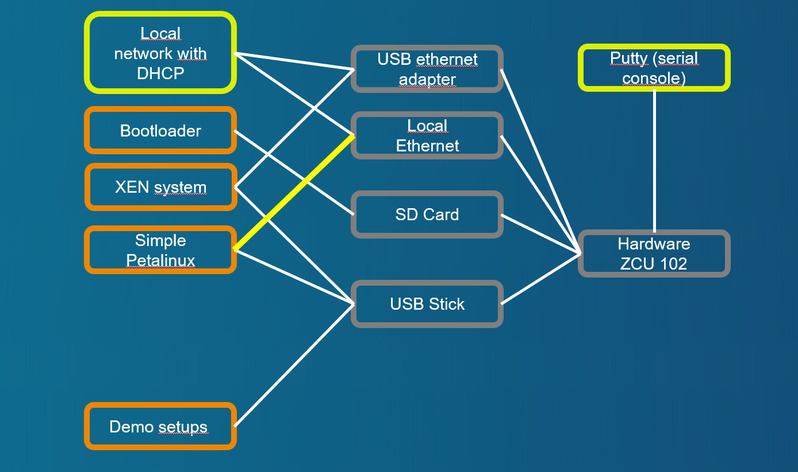

# Demo case with passed through NIC controller

[Back to **Table of Contents**](Readme.md)

## Setup and parts



Connections of ZCU102 board:

- USB stick with demo image, desription at [Setup of XEN demo image for USB stick or SD card (restricted function)](cr-demo-image.md)
- SD card with boot image, dicription at [Setup of XEN boot image for SD card](cr-boot-image.md)
- NIC controller is passed to **guest0** Vm and is connected to local subnet **192.168.1.0/24**.
- Domain-0 has connected an additional USB-Ethernet controller to access the same subnet.

## Demo sequence

### Interrupt the automatic boot process at bootloader
Reset the board and press a key while displaying **Hit any key to stop autoboot:**.

```
U-Boot 2023.01 (Mar 29 2023 - 13:08:40 +0000)

CPU:   ZynqMP
Silicon: v3
Chip:  zu9eg
Model: ZynqMP ZCU102 Rev1.0
Board: Xilinx ZynqMP
DRAM:  2 GiB (effective 4 GiB)
PMUFW:  v1.1
PMUFW:  No permission to change config object
Xilinx I2C Legacy format at nvmem0:
 Board name:    zcu102
 Board rev:     1.0
 Board SN:      881471742302-79140
 Ethernet mac:  00:0a:35:07:d4:af
EL Level:       EL2
Secure Boot:    not authenticated, not encrypted
Core:  76 devices, 31 uclasses, devicetree: board
NAND:  0 MiB
MMC:   mmc@ff170000: 0
Loading Environment from FAT... *** Error - No Valid Environment Area found
*** Warning - bad env area, using default environment

In:    serial
Out:   serial
Err:   serial
Bootmode: LVL_SHFT_SD_MODE1
Reset reason:   EXTERNAL
Net:
ZYNQ GEM: ff0e0000, mdio bus ff0e0000, phyaddr 12, interface rgmii-id
eth0: ethernet@ff0e0000
scanning bus for devices...
SATA link 0 timeout.
SATA link 1 timeout.
AHCI 0001.0301 32 slots 2 ports 6 Gbps 0x3 impl SATA mode
flags: 64bit ncq pm clo only pmp fbss pio slum part ccc apst
starting USB...
Bus usb@fe200000: Register 2000440 NbrPorts 2
Starting the controller
USB XHCI 1.00
scanning bus usb@fe200000 for devices... 6 USB Device(s) found
       scanning usb for storage devices... 1 Storage Device(s) found
Hit any key to stop autoboot:  0
ZynqMP>

```

### Configure passthrough of internal ethernet controller as "passthrough"

Set variable **bmode** to **pt_eth** before starting **** to select boot script ****.

```
ZynqMP> setenv bmode pt_eth
ZynqMP> boot

```
### Booting with XEN and Domain-0

Credentials at brandnew system are **login=petalinux**, password can be according needs of the tester.

### Check Network Connection at Domain-0 with used USB-Ethernet adapter
With **ifconfig** the state of the network is checked. Domain-0 has the IP **192.168.1.84**

```
zcu102-zynqmp:~$ ifconfig
eth0      Link encap:Ethernet  HWaddr A8:63:7D:61:10:83
          inet addr:192.168.1.84  Bcast:192.168.1.255  Mask:255.255.255.0
          inet6 addr: fe80::aa63:7dff:fe61:1083/64 Scope:Link
          UP BROADCAST RUNNING MULTICAST  MTU:1500  Metric:1
          RX packets:19 errors:0 dropped:0 overruns:0 frame:0
          TX packets:42 errors:0 dropped:0 overruns:0 carrier:0
          collisions:0 txqueuelen:1000
          RX bytes:1615 (1.5 KiB)  TX bytes:3666 (3.5 KiB)

lo        Link encap:Local Loopback
          inet addr:127.0.0.1  Mask:255.0.0.0
          inet6 addr: ::1/128 Scope:Host
          UP LOOPBACK RUNNING  MTU:65536  Metric:1
          RX packets:0 errors:0 dropped:0 overruns:0 frame:0
          TX packets:0 errors:0 dropped:0 overruns:0 carrier:0
          collisions:0 txqueuelen:1000
          RX bytes:0 (0.0 B)  TX bytes:0 (0.0 B)

zcu102-zynqmp:~$

```

### Starting Petalinux ramdisk image as Guest0 with passthrough configuration of internal ethernet controller

Start **Petalinux** with configuration at ****. Following or similar output should be displayed:

```
zcu102-zynqmp:/media/card$ sudo xl create example-passnet.cfg
Parsing config from example-passnet.cfg
libxl: info: libxl_create.c:122:libxl__domain_build_info_setdefault: qemu-xen is unavailable, using qemu-xen-traditional instead: No such file or directory
(XEN) memory_map:add: dom1 gfn=ff0e0 mfn=ff0e0 nr=1 cache=0
(XEN) smmu: /axi/smmu@fd800000: d1: p2maddr 0x000000087ff22000
(XEN) xen-source/xen/common/sched/null.c:355: 1 <-- d1v0
zcu102-zynqmp:/media/card$ (XEN) d1v0 Unhandled SMC/HVC: 0x84000050
(XEN) d1v0 Unhandled SMC/HVC: 0x8600ff01
(XEN) d1v0: vGICD: unhandled word write 0x000000ffffffff to ICACTIVER4
(XEN) d1v0: vGICD: unhandled word write 0x000000ffffffff to ICACTIVER8
(XEN) d1v0: vGICD: unhandled word write 0x000000ffffffff to ICACTIVER12
(XEN) d1v0: vGICD: unhandled word write 0x000000ffffffff to ICACTIVER16
(XEN) d1v0: vGICD: unhandled word write 0x000000ffffffff to ICACTIVER20
(XEN) d1v0: vGICD: unhandled word write 0x000000ffffffff to ICACTIVER0
(XEN) xen-source/xen/common/sched/null.c:355: 3 <-- d1v1
(XEN) d1v1: vGICD: unhandled word write 0x000000ffffffff to ICACTIVER0

zcu102-zynqmp:/media/card$
```

### Switch console to Guest0
Switch to console of **guest0**. Login with **login=petalinux**. Following or similar output should be displayed:
```
zcu102-zynqmp:/media/card$ sudo xl console guest0
...
[  OK  ] Started User Login Management.
[  OK  ] Reached target Multi-User System.
         Starting Record Runlevel Change in UTMP...
[  OK  ] Finished Record Runlevel Change in UTMP.

PetaLinux 2022.2_release_S10071807 xilinx-zcu102-20222 hvc0

xilinx-zcu102-20222 login:
```

### Check network connection at Guest0
Check the network state with **ifconfig**. Following or similar output should be displayed:
```
xilinx-zcu102-20222:~$ ifconfig
eth0      Link encap:Ethernet  HWaddr 00:0A:35:00:22:01
          inet addr:192.168.1.95  Bcast:192.168.1.255  Mask:255.255.255.0
          inet6 addr: fe80::20a:35ff:fe00:2201/64 Scope:Link
          UP BROADCAST RUNNING MULTICAST  MTU:1500  Metric:1
          RX packets:14 errors:0 dropped:0 overruns:0 frame:0
          TX packets:55 errors:0 dropped:0 overruns:0 carrier:0
          collisions:0 txqueuelen:1000
          RX bytes:1355 (1.3 KiB)  TX bytes:8887 (8.6 KiB)
          Interrupt:13

lo        Link encap:Local Loopback
          inet addr:127.0.0.1  Mask:255.0.0.0
          inet6 addr: ::1/128 Scope:Host
          UP LOOPBACK RUNNING  MTU:65536  Metric:1
          RX packets:2 errors:0 dropped:0 overruns:0 frame:0
          TX packets:2 errors:0 dropped:0 overruns:0 carrier:0
          collisions:0 txqueuelen:1000
          RX bytes:140 (140.0 B)  TX bytes:140 (140.0 B)

xilinx-zcu102-20222:~$
```

### Guest0 has connection to internet (google.de)
The internet connection of **guest0** can be tested with **ping** command to an external site.


```
xilinx-zcu102-20222:~$ ping google.de
PING google.de (142.250.107.94): 56 data bytes
64 bytes from 142.250.107.94: seq=0 ttl=105 time=152.592 ms
64 bytes from 142.250.107.94: seq=1 ttl=105 time=151.110 ms
64 bytes from 142.250.107.94: seq=2 ttl=105 time=151.341 ms
64 bytes from 142.250.107.94: seq=3 ttl=105 time=151.374 ms
^C
--- google.de ping statistics ---
4 packets transmitted, 4 packets received, 0% packet loss
round-trip min/avg/max = 151.110/151.604/152.592 ms
xilinx-zcu102-20222:~$

```
### Getting back console to Domain-0 (XEN)

Use **CTRL+5** to get back control to Domain-0.

### Domain-0 (192.168.1.84) tries to ping Guest0 (192.168.1.95)
The intradomain  connection can be tested with **ping** command to **guest0**.

```
zcu102-zynqmp:/media/card$ ping 192.168.1.95
PING 192.168.1.95 (192.168.1.95): 56 data bytes
64 bytes from 192.168.1.95: seq=0 ttl=64 time=0.661 ms
64 bytes from 192.168.1.95: seq=1 ttl=64 time=0.270 ms
64 bytes from 192.168.1.95: seq=2 ttl=64 time=0.274 ms
^C
--- 192.168.1.95 ping statistics ---
3 packets transmitted, 3 packets received, 0% packet loss
round-trip min/avg/max = 0.270/0.401/0.661 ms
zcu102-zynqmp:/media/card$
```

### Domain-0 can access Guest0 (192.168.1.95) via ssh connection
**guest0** can also be connected with **ssh** to **petalinux@192.168.1.95**.

```
zcu102-zynqmp:/media/card$ ssh petalinux@192.168.1.95
The authenticity of host '192.168.1.95 (192.168.1.95)' can't be established.
RSA key fingerprint is SHA256:HdM+LWU3PX67Ir7p+tahkDRfsUgdRYk1wNvPCC1WacI.
This key is not known by any other names
Are you sure you want to continue connecting (yes/no/[fingerprint])? yes
Warning: Permanently added '192.168.1.95' (RSA) to the list of known hosts.
petalinux@192.168.1.95's password:
xilinx-zcu102-20222:~$
```

### Guest0 exits from ssh connection, getting back console to Domain-0

```
xilinx-zcu102-20222:~$ exit
logout
Connection to 192.168.1.95 closed.
zcu102-zynqmp:/media/card$
```

### Switch console to Guest0
Switch to console of **guest0**. Login with **login=petalinux**. Following or similar output should be displayed:
```
zcu102-zynqmp:/media/card$ sudo xl console guest0
Password:

xilinx-zcu102-20222:~$

```

### Guest0 can access Domain-0 (192.168.1.84) via ssh connection
**Domain-0** can also be connected with **ssh** to **petalinux@192.168.1.98**. 

```
xilinx-zcu102-20222:~$ ssh petalinux@192.168.1.84

Host '192.168.1.84' is not in the trusted hosts file.
(ssh-ed25519 fingerprint sha1!! e1:2b:cc:26:a7:bf:36:55:83:e1:55:77:e7:e7:60:d9:f9:e3:c7:3d)
Do you want to continue connecting? (y/n) y
petalinux@192.168.1.84's password:
[ 1796.832502] audit: type=1006 audit(1690277226.878:2): pid=344 uid=0 old-auid=4294967295 auid=1000 tty=(none) old-ses=4294967295 ses=1 res=1
[ 1796.839568] audit: type=1300 audit(1690277226.878:2): arch=c00000b7 syscall=64 success=yes exit=4 a0=7 a1=ffffc2edce00 a2=4 a3=1 items=0 ppid=1 pid=344 auid=1000 uid=0 gid=0 euid=0 suid=0 fsuid=0 egid=0 sgid=0 fsgid=0 tty=(none) ses=1 comm="sshd" exe="/usr/sbin/sshd" key=(null)
[ 1796.871161] audit: type=1327 audit(1690277226.878:2): proctitle=737368643A20706574616C696E7578205B707269765D
Last login: Tue Jul 25 08:57:34 2023
zcu102-zynqmp:~$
```
