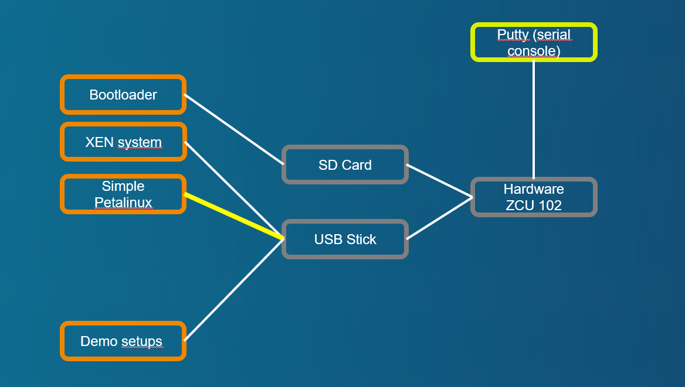

# Demo case with paravirtualized partition

[Back to **Table of Contents**](Readme.md)

## Setup and parts



Connections of ZCU102 board:

- USB stick with demo image, desription at [Setup of XEN demo image for USB stick or SD card (restricted function)](cr-demo-image.md)
- SD card with boot image, dicription at [Setup of XEN boot image for SD card](cr-boot-image.md)
- Partition 3 of demo image is prepared with root file system of **Petalinux** and is used to boot **guest0**.

## Demo sequence

### Starting with bootloader

U-Boot starts **** and without configuration nested script ****.

### Booting with XEN and Domain-0

Credentials at brandnew system are **login=petalinux**, password can be according needs of the tester.

### Starting "Paravirtualized block device" demo with Petalinux booting from P3 of file system 

Start **Petalinux** with configuration at ****. Following or similar output should be displayed:

```
zcu102-zynqmp:/media/card$ sudo xl create example-pvdisk.cfg
Parsing config from example-pvdisk.cfg
libxl: info: libxl_create.c:122:libxl__domain_build_info_setdefault: qemu-xen is unavailable, using qemu-xen-traditional instead: No such file or directory
(XEN) xen-source/xen/common/sched/null.c:355: 1 <-- d3v0
zcu102-zynqmp:/media/card$ (XEN) d3v0 Unhandled SMC/HVC: 0x84000050
(XEN) d3v0 Unhandled SMC/HVC: 0x8600ff01
(XEN) d3v0: vGICD: unhandled word write 0x000000ffffffff to ICACTIVER4
(XEN) d3v0: vGICD: unhandled word write 0x000000ffffffff to ICACTIVER8
(XEN) d3v0: vGICD: unhandled word write 0x000000ffffffff to ICACTIVER12
(XEN) d3v0: vGICD: unhandled word write 0x000000ffffffff to ICACTIVER16
(XEN) d3v0: vGICD: unhandled word write 0x000000ffffffff to ICACTIVER20
(XEN) d3v0: vGICD: unhandled word write 0x000000ffffffff to ICACTIVER0
(XEN) xen-source/xen/common/sched/null.c:355: 2 <-- d3v1
(XEN) d3v1: vGICD: unhandled word write 0x000000ffffffff to ICACTIVER0
[  261.579819] xen-blkback: backend/vbd/3/768: using 1 queues, protocol 1 (arm-abi) persistent grants

zcu102-zynqmp:/media/card$
```

### Check list of started Domains
```
zcu102-zynqmp:/media/card$ sudo xl list
Name                                        ID   Mem VCPUs      State   Time(s)
Domain-0                                     0  1024     1     r-----     391.0
guest0                                       1   511     2     r-----     433.0
```

### Switch console to Guest0
Check for started domains and switch to console of **guest0**. Login with **login=petalinux**. Following or similar output should be displayed:
```
zcu102-zynqmp:/media/card$ sudo xl console guest0
...
[  OK  ] Started User Login Management.
[  OK  ] Reached target Multi-User System.
         Starting Record Runlevel Change in UTMP...
[  OK  ] Finished Record Runlevel Change in UTMP.

PetaLinux 2022.2_release_S10071807 xilinx-zcu102-20222 hvc0

xilinx-zcu102-20222 login:
```

### /dev/xvda is the paravirtualized block device (partition 3)
/dev/xdva is the root device of the **guest0** vm.

```
xilinx-zcu102-20222:~$ mount | grep ' / '
/dev/xvda on / type ext3 (rw,relatime)
xilinx-zcu102-20222:~$
xilinx-zcu102-20222:~$ cat /proc/partitions
major minor  #blocks  name

   1        0      65536 ram0
   1        1      65536 ram1
   1        2      65536 ram2
   1        3      65536 ram3
   1        4      65536 ram4
   1        5      65536 ram5
   1        6      65536 ram6
   1        7      65536 ram7
   1        8      65536 ram8
   1        9      65536 ram9
   1       10      65536 ram10
   1       11      65536 ram11
   1       12      65536 ram12
   1       13      65536 ram13
   1       14      65536 ram14
   1       15      65536 ram15
 202        0    2929664 xvda
xilinx-zcu102-20222:~$
```
### Guest0 is not destroyed, but initiates a normal shutdown.
**guest0** does the shutdown with **sudo shutdown -P now**. The console returns to **Domain-0**.

```
xilinx-zcu102-20222:~$ sudo shutdown -P now

We trust you have received the usual lecture from the local System
Administrator. It usually boils down to these three things:

    #1) Respect the privacy of others.
    #2) Think before you type.
    #3) With great power comes great responsibility.

Password:
         Stopping Session c1 of User petalinux...
...
systemd/systemd-journald" nl-mcgrp=1 op=disconneczcu102-zynqmp:/media/card$ (XEN) xen-source/xen/common/sched/null.c:385: 3 <-- NULL (d1v1)
(XEN) xen-source/xen/common/sched/null.c:385: 1 <-- NULL (d1v0)

zcu102-zynqmp:/media/card$

```

