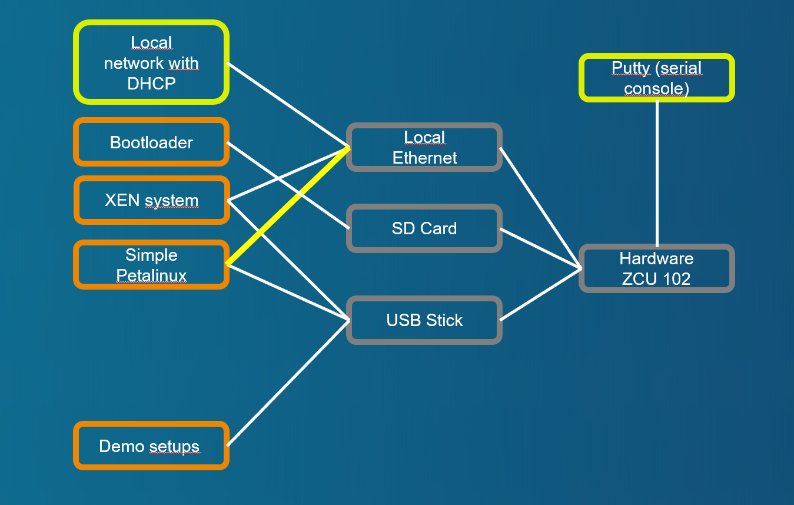

# Demo case with paravirtualized network

[Back to **Table of Contents**](Readme.md)

## Setup and parts



Connections of ZCU102 board:

- USB stick with demo image, desription at [Setup of XEN demo image for USB stick or SD card (restricted function)](cr-demo-image.md)
- SD card with boot image, dicription at [Setup of XEN boot image for SD card](cr-boot-image.md)
- The local **NIC** is connected to a local sub 192.168.1.0/24.

## Demo sequence

### Starting with bootloader

U-Boot starts **** and without configuration nested script ****.

### Booting with XEN and Domain-0

Credentials at brandnew system are **login=petalinux**, password can be according needs of the tester.

### Check Network Connection at Domain-0

Check the network state with **ifconfig**. Following or similar output should be displayed:
```
zcu102-zynqmp:~$ ifconfig
eth0      Link encap:Ethernet  HWaddr 00:0A:35:07:D4:AF
          inet addr:192.168.1.98  Bcast:192.168.1.255  Mask:255.255.255.0
          inet6 addr: fe80::20a:35ff:fe07:d4af/64 Scope:Link
          UP BROADCAST RUNNING MULTICAST  MTU:1500  Metric:1
          RX packets:9 errors:0 dropped:0 overruns:0 frame:0
          TX packets:28 errors:0 dropped:0 overruns:0 carrier:0
          collisions:0 txqueuelen:1000
          RX bytes:1065 (1.0 KiB)  TX bytes:2792 (2.7 KiB)
          Interrupt:46

lo        Link encap:Local Loopback
          inet addr:127.0.0.1  Mask:255.0.0.0
          inet6 addr: ::1/128 Scope:Host
          UP LOOPBACK RUNNING  MTU:65536  Metric:1
          RX packets:0 errors:0 dropped:0 overruns:0 frame:0
          TX packets:0 errors:0 dropped:0 overruns:0 carrier:0
          collisions:0 txqueuelen:1000
          RX bytes:0 (0.0 B)  TX bytes:0 (0.0 B)

zcu102-zynqmp:~$
```

### Create a network bridge to connect DomU Guest0
A script to create a network bridge **xenbr0** is provided at **** and has to be called with network interface to add.

```
zcu102-zynqmp:~$ cd /media/card
zcu102-zynqmp:/media/card$ sudo ./brcreate.sh eth0

We trust you have received the usual lecture from the local System
Administrator. It usually boils down to these three things:

    #1) Respect the privacy of others.
    #2) Think before you type.
    #3) With great power comes great responsibility.

Password:
[  481.686244] xenbr0: port 1(eth0) entered blocking state
[  481.686319] xenbr0: port 1(eth0) entered disabled state
[  481.691503] device eth0 entered promiscuous mode
[  481.698487] audit: type=1700 audit(1690264980.491:2): dev=eth0 prom=256 old_prom=0 auid=4294967295 uid=0 gid=0 ses=4294967295
[  481.707377] audit: type=1300 audit(1690264980.491:2): arch=c00000b7 syscall=29 success=yes exit=0 a0=3 a1=89a2 a2=ffffc98f6670 a3=4c45485300306874 items=0 ppid=310 pid=317 auid=4294967295 uid=0 gid=0 euid=0 suid=0 fsuid=0 egid=0 sgid=0 fsgid=0 tty=hvc0 ses=4294967295 comm="brctl" exe="/usr/sbin/brctl.bridge-utils" key=(null)
udhcpc: started, v1.35.0
[  481.775053] audit: type=1327 audit(1690264980.491:2): proctitle=627263746C0061646469660078656E6272300065746830
[  481.819919] xenbr0: port 1(eth0) entered blocking state
[  481.819990] xenbr0: port 1(eth0) entered forwarding state
udhcpc: broadcasting discover
udhcpc: broadcasting select for 192.168.1.98, server 192.168.1.46
udhcpc: lease of 192.168.1.98 obtained from 192.168.1.46, lease time 3600
/etc/udhcpc.d/50default: Adding DNS 9.9.9.9
zcu102-zynqmp:/media/card$ [  482.703704] IPv6: ADDRCONF(NETDEV_CHANGE): xenbr0: link becomes ready

zcu102-zynqmp:/media/card$ ifconfig
eth0      Link encap:Ethernet  HWaddr 00:0A:35:07:D4:AF
          inet6 addr: fe80::20a:35ff:fe07:d4af/64 Scope:Link
          UP BROADCAST RUNNING MULTICAST  MTU:1500  Metric:1
          RX packets:20 errors:0 dropped:0 overruns:0 frame:0
          TX packets:68 errors:0 dropped:0 overruns:0 carrier:0
          collisions:0 txqueuelen:1000
          RX bytes:2176 (2.1 KiB)  TX bytes:6554 (6.4 KiB)
          Interrupt:46

lo        Link encap:Local Loopback
          inet addr:127.0.0.1  Mask:255.0.0.0
          inet6 addr: ::1/128 Scope:Host
          UP LOOPBACK RUNNING  MTU:65536  Metric:1
          RX packets:0 errors:0 dropped:0 overruns:0 frame:0
          TX packets:0 errors:0 dropped:0 overruns:0 carrier:0
          collisions:0 txqueuelen:1000
          RX bytes:0 (0.0 B)  TX bytes:0 (0.0 B)

xenbr0    Link encap:Ethernet  HWaddr 00:0A:35:07:D4:AF
          inet addr:192.168.1.98  Bcast:192.168.1.255  Mask:255.255.255.0
          inet6 addr: fe80::20a:35ff:fe07:d4af/64 Scope:Link
          UP BROADCAST RUNNING MULTICAST  MTU:1500  Metric:1
          RX packets:5 errors:0 dropped:0 overruns:0 frame:0
          TX packets:26 errors:0 dropped:0 overruns:0 carrier:0
          collisions:0 txqueuelen:1000
          RX bytes:775 (775.0 B)  TX bytes:2578 (2.5 KiB)

zcu102-zynqmp:/media/card$

```

### Starting Petalinux ramdisk image as Guest0 with paravirtualized network setup
Start **Petalinux** with configuration at ****. Following or similar output should be displayed:

```
zcu102-zynqmp:/media/card$ sudo xl create example-pvnet.cfg
Parsing config from example-pvnet.cfg
libxl: info: libxl_create.c:122:libxl__domain_build_info_setdefault: qemu-xen is unavailable, using qemu-xen-traditional instead: No such file or directory
(XEN) xen-source/xen/common/memory.c:277:d0v0 Could not allocate order=18 extent: id=4 memflags=0xc0 (0 of 1)
[  349.561731] xenbr0: port 2(vif4.0) entered blocking state
[  349.561805] xenbr0: port 2(vif4.0) entered disabled state
[  349.567332] device vif4.0 entered promiscuous mode
[  349.574436] audit: type=1700 audit(1690274404.956:3): dev=vif4.0 prom=256 old_prom=0 auid=4294967295 uid=0 gid=0 ses=4294967295
[  349.583564] audit: type=1300 audit(1690274404.956:3): arch=c00000b7 syscall=29 success=yes exit=0 a0=3 a1=89a2 a2=ffffffe81240 a3=485300302e346669 items=0 ppid=449 pid=485 auid=4294967295 uid=0 gid=0 euid=0 suid=0 fsuid=0 egid=0 sgid=0 fsgid=0 tty=hvc0 ses=4294967295 comm="brctl" exe="/usr/sbin/brctl.bridge-utils" key=(null)
[  349.637190] audit: type=1327 audit(1690274404.956:3): proctitle=627263746C0061646469660078656E62723000766966342E30
(XEN) xen-source/xen/common/sched/null.c:355: 1 <-- d4v0
zcu102-zynqmp:/media/card$ (XEN) d4v0 Unhandled SMC/HVC: 0x84000050
(XEN) d4v0 Unhandled SMC/HVC: 0x8600ff01
(XEN) d4v0: vGICD: unhandled word write 0x000000ffffffff to ICACTIVER4
(XEN) d4v0: vGICD: unhandled word write 0x000000ffffffff to ICACTIVER8
(XEN) d4v0: vGICD: unhandled word write 0x000000ffffffff to ICACTIVER12
(XEN) d4v0: vGICD: unhandled word write 0x000000ffffffff to ICACTIVER16
(XEN) d4v0: vGICD: unhandled word write 0x000000ffffffff to ICACTIVER20
(XEN) d4v0: vGICD: unhandled word write 0x000000ffffffff to ICACTIVER0
(XEN) xen-source/xen/common/sched/null.c:355: 3 <-- d4v1
(XEN) d4v1: vGICD: unhandled word write 0x000000ffffffff to ICACTIVER0
(XEN) xen-source/xen/common/grant_table.c:1882:d4v0 Expanding d4 grant table from 1 to 2 frames
[  355.022688] vif vif-4-0 vif4.0: Guest Rx ready
[  355.022784] IPv6: ADDRCONF(NETDEV_CHANGE): vif4.0: link becomes ready
[  355.028281] xenbr0: port 2(vif4.0) entered blocking state
[  355.033613] xenbr0: port 2(vif4.0) entered forwarding state

zcu102-zynqmp:/media/card$
```

### Switch console to Guest0
Check for started domains and switch to console of **guest0**. Following or similar output should be displayed:
```
zcu102-zynqmp:/media/card$ sudo xl list
Name                                        ID   Mem VCPUs      State   Time(s)
Domain-0                                     0  1024     1     r-----     391.0
guest0                                       1   511     2     r-----     433.0
zcu102-zynqmp:/media/card$ sudo xl console guest0
...
[  OK  ] Started User Login Management.
[  OK  ] Reached target Multi-User System.
         Starting Record Runlevel Change in UTMP...
[  OK  ] Finished Record Runlevel Change in UTMP.

PetaLinux 2022.2_release_S10071807 xilinx-zcu102-20222 hvc0

xilinx-zcu102-20222 login:
```

Login with **login=petalinux**, password can be any.

### Check Network Connection at Guest0
Check the network state with **ifconfig**. Following or similar output should be displayed:
```
xilinx-zcu102-20222:~$ ifconfig
eth0      Link encap:Ethernet  HWaddr 00:16:3E:07:A2:33
          inet addr:192.168.1.115  Bcast:192.168.1.255  Mask:255.255.255.0
          inet6 addr: fe80::216:3eff:fe07:a233/64 Scope:Link
          UP BROADCAST RUNNING MULTICAST  MTU:1500  Metric:1
          RX packets:32 errors:0 dropped:0 overruns:0 frame:0
          TX packets:47 errors:0 dropped:0 overruns:0 carrier:0
          collisions:0 txqueuelen:1000
          RX bytes:4231 (4.1 KiB)  TX bytes:6576 (6.4 KiB)

lo        Link encap:Local Loopback
          inet addr:127.0.0.1  Mask:255.0.0.0
          inet6 addr: ::1/128 Scope:Host
          UP LOOPBACK RUNNING  MTU:65536  Metric:1
          RX packets:82 errors:0 dropped:0 overruns:0 frame:0
          TX packets:82 errors:0 dropped:0 overruns:0 carrier:0
          collisions:0 txqueuelen:1000
          RX bytes:6220 (6.0 KiB)  TX bytes:6220 (6.0 KiB)

xilinx-zcu102-20222:~$
```

### Guest0 (192.168.1.115) tries to ping Domain-0 (192.168.1.98)

The intradomain  connection can be tested with **ping** command to **Domain-0**.

```
xilinx-zcu102-20222:~$ ping 192.168.1.98
PING 192.168.1.98 (192.168.1.98): 56 data bytes
64 bytes from 192.168.1.98: seq=0 ttl=64 time=0.746 ms
64 bytes from 192.168.1.98: seq=1 ttl=64 time=0.206 ms
64 bytes from 192.168.1.98: seq=2 ttl=64 time=0.140 ms
64 bytes from 192.168.1.98: seq=3 ttl=64 time=0.132 ms
^C
--- 192.168.1.98 ping statistics ---
4 packets transmitted, 4 packets received, 0% packet loss
round-trip min/avg/max = 0.132/0.306/0.746 ms
xilinx-zcu102-20222:~$

```

### Guest0 has also connection to internet (google.de)
The internet connection of **guest0** can be tested with **ping** command to an external site.


```
xilinx-zcu102-20222:~$ ping google.de
PING google.de (142.250.184.227): 56 data bytes
64 bytes from 142.250.184.227: seq=0 ttl=115 time=19.069 ms
64 bytes from 142.250.184.227: seq=1 ttl=115 time=17.682 ms
64 bytes from 142.250.184.227: seq=2 ttl=115 time=17.766 ms
64 bytes from 142.250.184.227: seq=3 ttl=115 time=18.339 ms
^C
--- google.de ping statistics ---
4 packets transmitted, 4 packets received, 0% packet loss
round-trip min/avg/max = 17.682/18.214/19.069 ms
xilinx-zcu102-20222:~$

```

### Guest0 can access Domain-0(192.168.1.98) via ssh connection
**Domain-0** can also be connected with **ssh** to **petalinux@192.168.1.98**. 

```
xilinx-zcu102-20222:~$ ssh petalinux@192.168.1.98

Host '192.168.1.98' is not in the trusted hosts file.
(ssh-ed25519 fingerprint sha1!! 2b:75:f8:e6:af:1c:8a:66:0c:2e:4a:93:74:00:c6:a1:a0:4d:2c:35)
Do you want to continue connecting? (y/n) y
petalinux@192.168.1.98's password:
[ 1243.226722] audit: type=1006 audit(1690265741.964:4): pid=406 uid=0 old-auid=4294967295 auid=1000 tty=(none) old-ses=4294967295 ses=1 res=1
[ 1243.233784] audit: type=1300 audit(1690265741.964:4): arch=c00000b7 syscall=64 success=yes exit=4 a0=7 a1=ffffc5564e40 a2=4 a3=1 items=0 ppid=1 pid=406 auid=1000 uid=0 gid=0 euid=0 suid=0 fsuid=0 egid=0 sgid=0 fsgid=0 tty=(none) ses=1 comm="sshd" exe="/usr/sbin/sshd" key=(null)
[ 1243.265430] audit: type=1327 audit(1690265741.964:4): proctitle=737368643A20706574616C696E7578205B707269765D
Last login: Tue Jul 25 05:55:55 2023
zcu102-zynqmp:~$ exit
logout
xilinx-zcu102-20222:~$
```

### Getting back console to Domain-0 (XEN)

Use **CTRL+5** to get back control to Domain-0.

### Domain-0 can access Guest0 (192.168.1.94) via ssh connection

**guest0** can also be connected with **ssh** to **petalinux@192.168.1.115**.

```
xilinx-zcu102-20222:~$ ssh petalinux@192.168.1.115

Host '192.168.1.115' is not in the trusted hosts file.
(ssh-rsa fingerprint sha1!! 94:dc:c9:ca:14:e5:84:c7:41:c5:9b:59:6b:29:21:e2:5d:45:35:83)
Do you want to continue connecting? (y/n) y
petalinux@192.168.1.115's password:
xilinx-zcu102-20222:~$
```

### Guest0 is not destroyed, but initiates a normal shutdown.

At ssh conection at **guest0** the VM will shutdown with **sudo shutdown -P now**. The console returns to **Domain-0**.

```
xilinx-zcu102-20222:~$ sudo shutdown -P now

We trust you have received the usual lecture from the local System
Administrator. It usually boils down to these three things:

    #1) Respect the privacy of others.
    #2) Think before you type.
    #3) With great power comes great responsibility.

Password:
         Stopping Session c1 of User petalinux...
...
systemd/systemd-journald" nl-mcgrp=1 op=disconneczcu102-zynqmp:/media/card$ (XEN) xen-source/xen/common/sched/null.c:385: 3 <-- NULL (d1v1)
(XEN) xen-source/xen/common/sched/null.c:385: 1 <-- NULL (d1v0)

zcu102-zynqmp:/media/card$

```

### Guest0 has been removed from XEN domain list

Use **xl list** to look for state of XEN. Following or similar output should be displayed:
```
zcu102-zynqmp:/media/card$ sudo xl list
Name                                        ID   Mem VCPUs      State   Time(s)
Domain-0                                     0  1024     1     r-----    1201.1
zcu102-zynqmp:/media/card$
```

