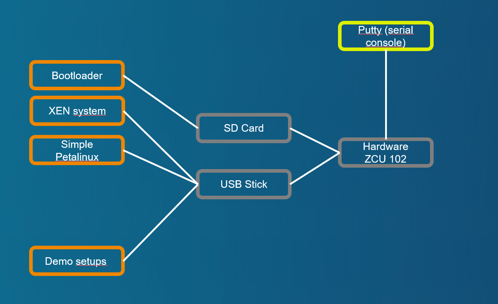

# Demo case with simple Linux VM (Petalinux)

[Back to **Table of Contents**](Readme.md)

## Setup and parts



Connections of ZCU102 board:

- USB stick with demo image, desription at [Setup of XEN demo image for USB stick or SD card (restricted function)](cr-demo-image.md)
- SD card with boot image, dicription at [Setup of XEN boot image for SD card](cr-boot-image.md)

## Demo sequence

### Starting with bootloader

U-Boot starts **** and without configuration nested script ****.

### Booting with XEN and Domain-0

Credentials at brandnew system are **login=petalinux**, password can be according needs of the tester.

### Check list of started Domains
After login please check the state of XEN with **xl list**. Following or similar output should be displayed:

```
zcu102-zynqmp:~$ sudo xl list
Name                                        ID   Mem VCPUs      State   Time(s)
Domain-0                                     0  1024     1     r-----      52.9

```

### Starting "Simple" demo with Petalinux ramdisk image
Start **Petalinux** with configuration at ****. Following or similar output should be displayed:

```
zcu102-zynqmp:~$ cd /media/card
zcu102-zynqmp:/media/card$ sudo xl create example-simple.cfg
Parsing config from example-simple.cfg
libxl: info: libxl_create.c:122:libxl__domain_build_info_setdefault: qemu-xen is unavailable, using qemu-xen-traditional instead: No such file or directory
(XEN) xen-source/xen/common/sched/null.c:355: 1 <-- d1v0
zcu102-zynqmp:/media/card$ (XEN) d1v0 Unhandled SMC/HVC: 0x84000050
(XEN) d1v0 Unhandled SMC/HVC: 0x8600ff01
(XEN) d1v0: vGICD: unhandled word write 0x000000ffffffff to ICACTIVER4
(XEN) d1v0: vGICD: unhandled word write 0x000000ffffffff to ICACTIVER8
(XEN) d1v0: vGICD: unhandled word write 0x000000ffffffff to ICACTIVER12
(XEN) d1v0: vGICD: unhandled word write 0x000000ffffffff to ICACTIVER16
(XEN) d1v0: vGICD: unhandled word write 0x000000ffffffff to ICACTIVER20
(XEN) d1v0: vGICD: unhandled word write 0x000000ffffffff to ICACTIVER0
(XEN) xen-source/xen/common/sched/null.c:355: 2 <-- d1v1
(XEN) d1v1: vGICD: unhandled word write 0x000000ffffffff to ICACTIVER0

zcu102-zynqmp:/media/card$

```
### Switch console to Guest0
Check for started domains and switch to console of **guest0**. Following or similar output should be displayed:
```
zcu102-zynqmp:/media/card$ sudo xl list
Name                                        ID   Mem VCPUs      State   Time(s)
Domain-0                                     0  1024     1     r-----     391.0
guest0                                       1   511     2     r-----     433.0
zcu102-zynqmp:/media/card$ sudo xl console guest0
...
[  OK  ] Started User Login Management.
[  OK  ] Reached target Multi-User System.
         Starting Record Runlevel Change in UTMP...
[  OK  ] Finished Record Runlevel Change in UTMP.

PetaLinux 2022.2_release_S10071807 xilinx-zcu102-20222 hvc0

xilinx-zcu102-20222 login:
```

Login with **login=petalinux**, password can be any.

### No Network interfaces
Look for network interfaces with **ifconfig**. Following or similar output should be displayed:

```
xilinx-zcu102-20222:~$ ifconfig
lo        Link encap:Local Loopback
          inet addr:127.0.0.1  Mask:255.0.0.0
          inet6 addr: ::1/128 Scope:Host
          UP LOOPBACK RUNNING  MTU:65536  Metric:1
          RX packets:2 errors:0 dropped:0 overruns:0 frame:0
          TX packets:2 errors:0 dropped:0 overruns:0 carrier:0
          collisions:0 txqueuelen:1000
          RX bytes:140 (140.0 B)  TX bytes:140 (140.0 B)

xilinx-zcu102-20222:~$

```

No interfaces but **lo** exist.

### No block devices but ramdisks
Look for network interfaces with **cat /proc/partitions**. Following or similar output should be displayed:

```
xilinx-zcu102-20222:~$ cat /proc/partitions
major minor  #blocks  name

   1        0      65536 ram0
   1        1      65536 ram1
   1        2      65536 ram2
   1        3      65536 ram3
   1        4      65536 ram4
   1        5      65536 ram5
   1        6      65536 ram6
   1        7      65536 ram7
   1        8      65536 ram8
   1        9      65536 ram9
   1       10      65536 ram10
   1       11      65536 ram11
   1       12      65536 ram12
   1       13      65536 ram13
   1       14      65536 ram14
   1       15      65536 ram15
```

No block devices but **ram\*** exist.

### Getting back console to Domain-0 (XEN)

Use **CTRL+5** to get back control to Domain-0.

### Destroy DomU Guest0

Use **xl destroy guest0** to destroy Petalinux VM. Following or similar output should be displayed:

```
zcu102-zynqmp:/media/card$ sudo xl destroy guest0
Password:
zcu102-zynqmp:/media/card$
```

### Guest0 has been removed from XEN domain list

Use **xl list** to look for state of XEN. Following or similar output should be displayed:
```
zcu102-zynqmp:/media/card$ sudo xl list
Name                                        ID   Mem VCPUs      State   Time(s)
Domain-0                                     0  1024     1     r-----    1201.1
zcu102-zynqmp:/media/card$
```

Domain **guest0** has been destroyed.

