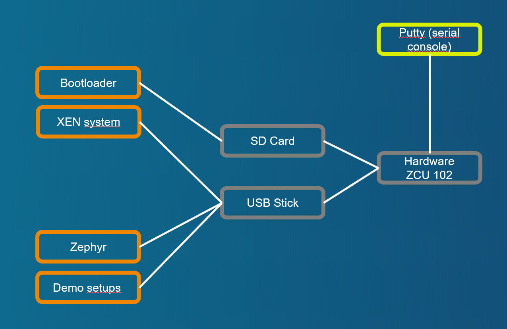

# Demo case with Zephyr VM

[Back to **Table of Contents**](Readme.md)

## Setup and parts



Connections of ZCU102 board:

- USB stick with demo image, desription at [Setup of XEN demo image for USB stick or SD card (restricted function)](cr-demo-image.md)
- SD card with boot image, dicription at [Setup of XEN boot image for SD card](cr-boot-image.md)

## Demo sequence

### Starting with bootloader

U-Boot starts **** and without configuration nested script ****.

### Booting with XEN and Domain-0

Credentials at brandnew system are **login=petalinux**, password can be according needs of the tester.

### Starting "Zephyr" demo with Zephyr image

Start **Zephyr** with configuration at ****. Following or similar output should be displayed:

```
zcu102-zynqmp:~$ cd /media/card
zcu102-zynqmp:/media/card$ sudo xl create example_zephyr.cfg
Password:
Parsing config from example_zephyr.cfg
libxl: warning: libxl_create.c:1108:libxl__domain_config_setdefault: XSM Disabled: init_seclabel not supported
libxl: info: libxl_create.c:122:libxl__domain_build_info_setdefault: qemu-xen is unavailable, using qemu-xen-traditional instead: No such file or directory
(XEN) IOMMU requested but not available
(XEN) xen-source/xen/common/sched/null.c:355: 1 <-- d1v0
(XEN) d1v0: vGICD: unhandled word write 0x000000ffffffff to ICACTIVER4
(XEN) d1v0: vGICD: unhandled word write 0x000000ffffffff to ICACTIVER8
(XEN) d1v0: vGICD: unhandled word write 0x000000ffffffff to ICACTIVER12
zcu102-zynqmp:/media/card$ (XEN) d1v0: vGICD: unhandled word write 0x000000ffffffff to ICACTIVER16
(XEN) d1v0: vGICD: unhandled word write 0x000000ffffffff to ICACTIVER20
(XEN) d1v0: vGICD: unhandled word write 0x000000ffffffff to ICACTIVER0

zcu102-zynqmp:/media/card$
```

### Check list of started Domains

Check for started domains with **xl list**. Following or similar output should be displayed:
```
zcu102-zynqmp:/media/card$ sudo xl list
Name                                        ID   Mem VCPUs      State   Time(s)
Domain-0                                     0  1024     1     r-----     467.7
DomZ                                         1    16     1     r-----     247.8
zcu102-zynqmp:/media/card$
...

### Switch console to DomZ (Zephyr)

Switch to console of **DomZ**. Following or similar output should be displayed:
```
zcu102-zynqmp:/media/card$ sudo xl console DomZ
thread_a: Hello World from cpu 0 on xenvm!
thread_b: Hello World from cpu 0 on xenvm!
thread_a: Hello World from cpu 0 on xenvm!
thread_b: Hello World from cpu 0 on xenvm!
thread_a: Hello World from cpu 0 on xenvm!
thread_b: Hello World from cpu 0 on xenvm!
...
...

### Getting back console to Domain-0 (XEN)

Use **CTRL+5** to get back control to Domain-0.

### Destroy DomU "DomZ" 
Use **xl destroy DomZ** to destroy Zephyr VM. Following or similar output should be displayed:

```
zcu102-zynqmp:/media/card$ sudo xl destroy DomZ
Password:
zcu102-zynqmp:/media/card$
```

### "DomZ" has been removed from XEN domain list

Use **xl list** to look for state of XEN. Following or similar output should be displayed:
```
zcu102-zynqmp:/media/card$ sudo xl list
Name                                        ID   Mem VCPUs      State   Time(s)
Domain-0                                     0  1024     1     r-----    1201.1
zcu102-zynqmp:/media/card$
```

Domain **DomZ** has been destroyed.
