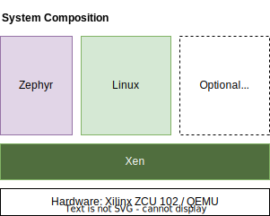

# ELISA Systems Working Group
The Systems WG aims to enable other working groups within ELISA to put their safety claims towards Linux in a wider system context. This is done in the form of a reproducible reference system based on real-world architectures, implemented fully based on Open-Source technologies. The Systems WG encourages interactions with other projects, which either also help enable safety use cases with Open-Source software or plan to make use of mixed-criticality system elements as a base for their product lines.

The working group meets almost every week.
- The meeting invitation is send out via mailing list
- The meeting series is listed in the [ELISA public meeting calendar](https://elisa.tech/community/meetings/).
- The minutes of meeting are kept within the repo wiki: https://github.com/elisa-tech/wg-systems/wiki#meetings

**We always welcome interested people and (potential) contributors.**

## Resources and links
Link to the mailing list: https://lists.elisa.tech/g/systems 
Link to ELISA public meeting calendar: https://elisa.tech/community/meetings/

---

# ELISA Example System Documentation

As part of the systems WG activities an example system was created. It represents an
architecture found in Automotive, Aerospace or Industrial application. It consists of
an RTOS, Hypervisor, and Linux (yocto and/or Debian).

The system elements used so far are mainly:

- [Apertis](https://www.apertis.org)
- [Xen](https://xenproject.org/)
- [Yocto](https://www.yoctoproject.org) (Petalinux)
- [Zephyr](https://zephyrproject.org/)

They are stacked together as per following block diagram:

The full documentation can be found under:

  - [Documentation/xen-demo-zcu102/Readme](Documentation/xen-demo-zcu102/Readme.md)

A detailed introduction on the system composition including some demos was recorded
during the embedded Linux conference 2023

---

